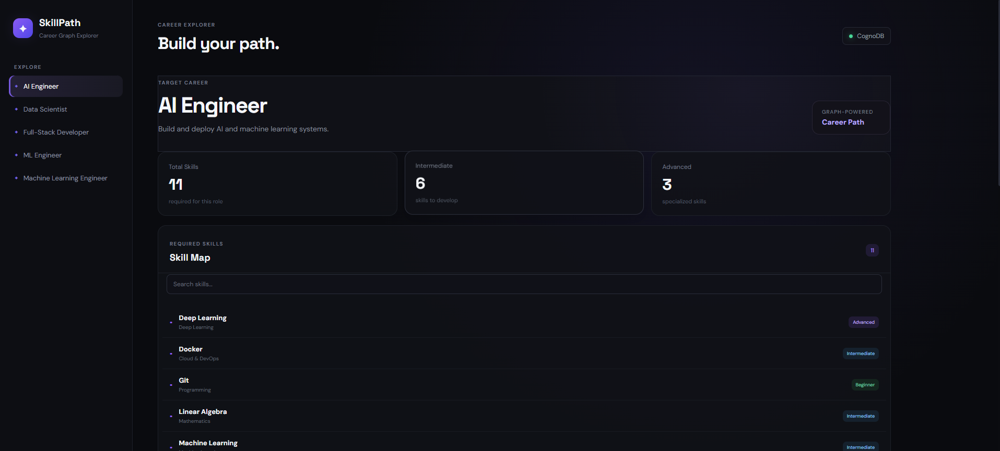
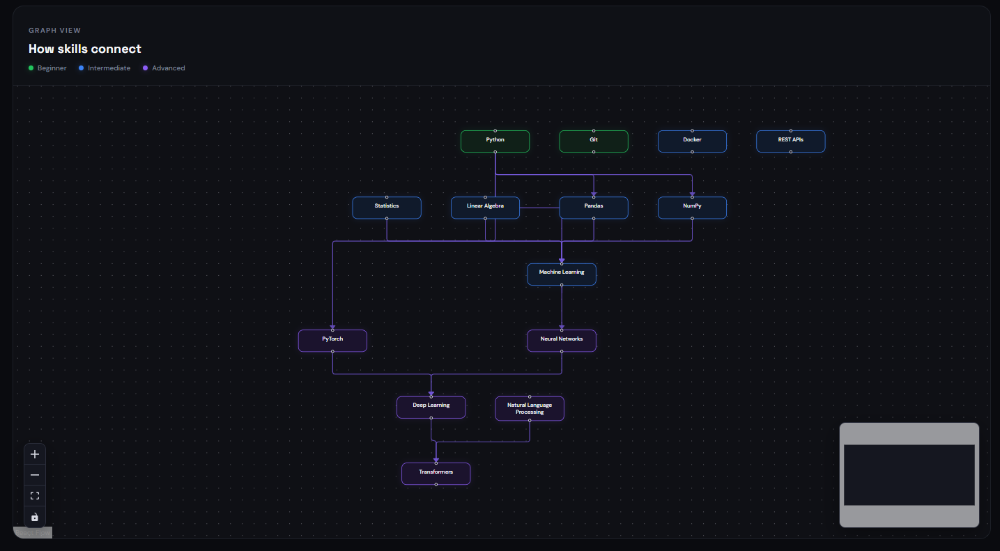
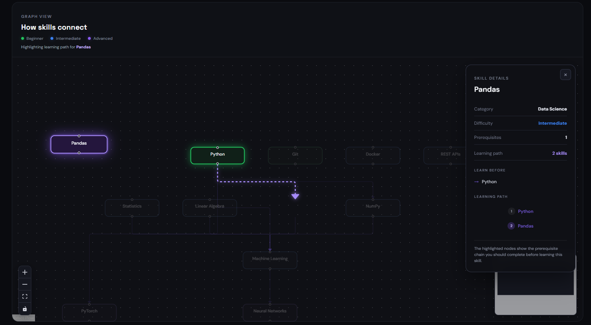

# SkillPath 🚀

## Graph-Powered Career & Skill Path Explorer

SkillPath is a web application that helps users explore career paths through the relationships between **careers, skills, and skill prerequisites**.

Instead of showing a flat list of skills, SkillPath represents the relationships as a graph and helps users understand **what to learn first and how skills connect to a target career**.

### Live Demo

**Hosted application:**  
https://skill-path-5zt9ebfyv-harsha-vardhan-gudlas-projects.vercel.app/

### Screen Recording

**Demo video:**  
https://drive.google.com/file/d/11PXwbG2zm4UDUdoWJqDQX432I5PnOWQ1/view?usp=sharing

---

## Features

- Explore multiple career paths
- View skills required for a career
- Categorize skills as Beginner, Intermediate, or Advanced
- Search for skills
- View an interactive skill dependency graph
- Click a skill to view its details
- Identify prerequisite skills
- Generate a learning path toward a selected skill
- Highlight prerequisite chains in the graph
- Switch between different careers
- Store career/skill relationships in CognoDB

---

## Why a Graph Database?

The core of SkillPath is based on relationships between entities.

For example:

```text
Python → Pandas → Machine Learning → Deep Learning → Transformers
```

A relational database could store careers and skills in separate tables, but answering questions involving **multiple prerequisite levels and connected skill paths** would require several joins and additional application logic.

A graph database represents these relationships directly:

```text
(Career)-[:REQUIRES]->(Skill)
(Skill)-[:REQUIRES]->(Skill)
```

This makes relationship-based queries such as:

- What skills are required for this career?
- What should I learn before this skill?
- What is the learning path to a particular skill?
- How are skills connected across multiple levels?

natural graph traversal problems.

This is the main reason CognoDB is used as the data layer.

---

## Tech Stack

### Frontend

- React
- Vite
- React Flow
- Dagre
- CSS

### Backend

- Python
- FastAPI
- Uvicorn
- Neo4j Python Driver

### Database

- CognoDB
- openCypher
- Bolt protocol

### Deployment

- Vercel

---

## Architecture

```text
┌──────────────────────────────┐
│          React UI            │
│                              │
│  Career Explorer             │
│  Skill Search                │
│  Skill Details               │
│  Interactive Skill Graph     │
└──────────────┬───────────────┘
               │
               │ REST API
               ▼
┌──────────────────────────────┐
│          FastAPI             │
│                              │
│  Career APIs                 │
│  Skill APIs                  │
│  Graph Queries               │
└──────────────┬───────────────┘
               │
               │ Neo4j Driver
               │ openCypher
               ▼
┌──────────────────────────────┐
│          CognoDB             │
│                              │
│  Careers                     │
│  Skills                      │
│  Prerequisites               │
│  Relationships               │
└──────────────────────────────┘
```

---

## Graph Data Model

The main entities are **Career** and **Skill**.

Skills are connected to careers and to other skills through prerequisite relationships.

```text
                 ┌──────────────┐
                 │   Career     │
                 │  AI Engineer │
                 └──────┬───────┘
                        │
                    REQUIRES
                        │
                        ▼
                 ┌──────────────┐
                 │    Skill     │
                 │     ML       │
                 └──────┬───────┘
                        │
                    REQUIRES
                        │
                        ▼
                 ┌──────────────┐
                 │    Skill     │
                 │   Python     │
                 └──────────────┘
```

### Node properties

**Career**

- `name`
- `description`

**Skill**

- `name`
- `category`
- `difficulty`

### Relationships

- `(:Career)-[:REQUIRES]->(:Skill)`
- `(:Skill)-[:REQUIRES]->(:Skill)`

The relationship structure is what allows SkillPath to calculate prerequisite chains and learning paths.

---

## Data & Seed

The repository contains a seed script used to populate the graph database with realistic career and skill data.

The seed data includes careers such as:

- AI Engineer
- Data Scientist
- Full-Stack Developer
- ML Engineer
- Machine Learning Engineer

The graph also contains skills such as:

- Python
- Git
- Docker
- Statistics
- Linear Algebra
- NumPy
- Pandas
- Machine Learning
- PyTorch
- Neural Networks
- Deep Learning
- Natural Language Processing
- Transformers
- REST APIs

The seed script can be used to recreate the graph data in a CognoDB instance.

---

## Cypher Queries

The backend uses parameterised Cypher queries through the official Neo4j Python driver.

### 1. Find skills required by a career

A career-to-skill traversal retrieves the skills associated with the selected career.

```cypher
MATCH (c:Career {name: $career_name})-[:REQUIRES]->(s:Skill)
RETURN s
ORDER BY s.name
```

The career name is passed as a query parameter rather than being concatenated into the Cypher string.

### 2. Multi-hop prerequisite traversal

SkillPath also traverses multiple prerequisite levels.

```cypher
MATCH path =
  (target:Skill {name: $skill_name})
  <-[:REQUIRES*1..]-
  (prerequisite:Skill)
RETURN path
```

This allows the application to identify prerequisite chains instead of only checking the immediate parent skill.

### 3. Learning path

The graph relationships are used to determine the order in which prerequisite skills should be learned before reaching a selected target skill.

This is one of the areas where a graph traversal is more natural than repeatedly joining relational tables.

> The exact Cypher implementations used by the application are contained in `backend/queries.py`.

---

## Project Structure

```text
SkillPath/
│
├── backend/
│   ├── database.py
│   ├── main.py
│   ├── queries.py
│   ├── seed.py
│   ├── test_connection.py
│   └── requirements.txt
│
├── frontend/
│   ├── public/
│   ├── src/
│   │   ├── App.jsx
│   │   ├── App.css
│   │   ├── index.css
│   │   ├── main.jsx
│   │   └── assets/
│   ├── package.json
│   └── vite.config.js
│
├── .gitignore
├── .env
├── vercel.json
└── README.md
```

---

## Environment Variables

Database credentials are kept outside the source code.

Create a `.env` file with:

```env
COGNODB_URI=your_cognodb_bolt_uri
COGNODB_USERNAME=cognodb
COGNODB_PASSWORD=your_cognodb_password
```

Do **not** commit `.env` or database credentials to GitHub.

The deployed application uses the same values as Vercel environment variables.

---

## Running Locally

### 1. Clone the repository

```bash
git clone https://github.com/harshavardhangudla/SkillPath.git
cd SkillPath
```

### 2. Backend setup

```bash
cd backend
python -m venv venv
```

Windows:

```bash
venv\Scripts\activate
```

Install dependencies:

```bash
pip install -r requirements.txt
```

Start FastAPI:

```bash
uvicorn main:app --reload
```

The backend runs locally on:

```text
http://127.0.0.1:8000
```

### 3. Frontend setup

Open another terminal:

```bash
cd frontend
npm install
npm run dev
```

Open the Vite development URL shown in the terminal.

---

## CognoDB Setup

1. Create a CognoDB Cloud account.
2. Create a free CognoDB instance.
3. Copy the generated Bolt URI and password.
4. Add them to the environment variables.
5. Run the seed script to populate the graph.

Example:

```bash
cd backend
python seed.py
```

The application then connects to CognoDB through the official Neo4j Python driver.

---

## Error Handling

If the graph database is unavailable, the application displays a connection error rather than failing silently.

The UI provides a clear message indicating that the backend/database connection needs to be available.

---

## Screenshots

### Career Explorer



### Interactive Skill Graph



### Skill Details & Learning Path



---

## Demo

The hosted application demonstrates the complete flow:

1. Select a career.
2. View the required skills.
3. Search for a skill.
4. Explore the skill dependency graph.
5. Select a skill.
6. View its prerequisites.
7. View the resulting learning path.

**Live Demo:**  
https://skill-path-5zt9ebfyv-harsha-vardhan-gudlas-projects.vercel.app/

**Screen Recording:**  
https://drive.google.com/file/d/11PXwbG2zm4UDUdoWJqDQX432I5PnOWQ1/view?usp=sharing

---

## Assignment Requirements Checklist

| Requirement | Status |
|---|---|
| CognoDB graph database | ✅ |
| Thoughtful graph data model | ✅ |
| Typed relationships and properties | ✅ |
| Seed data and seed script | ✅ |
| Cypher queries | ✅ |
| Multi-hop graph traversal | ✅ |
| Parameterised queries | ✅ |
| Functional web application | ✅ |
| Interactive UI | ✅ |
| Graceful database connection error | ✅ |
| Environment variables for credentials | ✅ |
| GitHub repository | ✅ |
| Hosted application demo | ✅ |
| Screen recording | ✅ |
| README with setup instructions | ✅ |
| README with data model diagram | ✅ |
| README with query explanation | ✅ |
| README with UI screenshots | ✅ |

---

## Links

- **GitHub:** https://github.com/harshavardhangudla/SkillPath
- **Live Demo:** https://skill-path-5zt9ebfyv-harsha-vardhan-gudlas-projects.vercel.app/
- **Demo Video:** https://drive.google.com/file/d/11PXwbG2zm4UDUdoWJqDQX432I5PnOWQ1/view?usp=sharing
